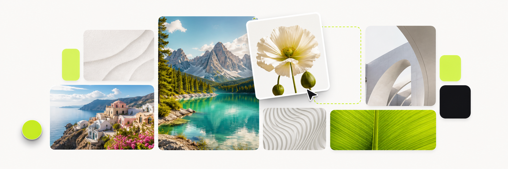

# Collage Studio



Collage Studio is a desktop-first photo collage editor built with Flutter. It
provides a focused workspace for arranging photos, refining their appearance,
and exporting polished PNG images for social media, presentations, and print.

## Features

- Drag and drop photos directly into the workspace.
- Choose from 11 layouts, including grids, editorial compositions, filmstrips,
  mosaics, and hero layouts.
- Adjust spacing, rounded corners, and the canvas background.
- Apply sepia and cool-tone presets or customize brightness, contrast,
  saturation, and warmth for each photo.
- Export using presets for Instagram posts and stories, Facebook covers,
  X/Twitter posts, presentations, and print.
- Save high-resolution collages as PNG files.
- Use the interface in Arabic, Chinese, English, French, German, Japanese,
  Portuguese, Russian, or Spanish.

## Install

### Snap Store

Once the stable release is available in the Snap Store, install it with:

```bash
sudo snap install lsb-collage-studio
```

### Local snap package

To install a locally built package:

```bash
sudo snap install --dangerous ./lsb-collage-studio_1.0.0_amd64.snap
```

## Build from source

Collage Studio currently targets Linux desktop. Install a current Flutter SDK
with Linux desktop support, then run:

```bash
flutter pub get
flutter run -d linux
```

Create a release build with:

```bash
flutter build linux --release
```

To package the release as a snap:

```bash
snapcraft pack
```

The Snapcraft recipe packages the release bundle generated under
`build/linux/x64/release/bundle`.

## How to use

1. Select a collage layout from the left panel.
2. Add photos with the file picker or drag them into the window.
3. Drop each photo into a frame and select it to adjust its appearance.
4. Choose the target size and customize spacing, corners, and background.
5. Select **Export** and choose where to save the PNG file.

## Support the project

If Collage Studio is useful to you, you can support its continued development
with a donation:

[](https://paypal.me/leandrosb3)

## License

Collage Studio is available under the [MIT License](LICENSE).
